# Diagrama de clases — StudentIDE Platform

---

## Convenciones de lectura

| Notación | Significado |
|---|---|
| `..|>` | Realización — la clase implementa la interfaz |
| `-->` | Uso directo — el controller instancia el model |
| `..>` | Dependencia — el componente requiere la interfaz |
| `*--` | Composición — el padre contiene y gestiona el ciclo de vida del hijo |
| `<<interface>>` | Interfaz (contrato entre capas) |
| `<<Facade>>` | Patrón Facade — punto de entrada único al servidor |

---

## Diagrama

```mermaid
classDiagram
  direction TB

  %% ════════════════════════════════════════════════════════════════
  %% INTERFACES — contratos entre capas
  %% ════════════════════════════════════════════════════════════════

  class IAutenticacion {
    <<interface>>
    +login(email, password) TokenSesion
    +cerrarSesion(token) void
  }

  class IEditor {
    <<interface>>
    +abrirArchivo(ruta) Archivo
    +guardarArchivo(archivo) bool
    +bloquearPegado(evento) void
  }

  class IEjecucion {
    <<interface>>
    +ejecutarScript(ruta) ResultadoEjecucion
    +ejecutarComando(cmd) ResultadoEjecucion
  }

  class IGestorTareas {
    <<interface>>
    +listarTareas(token) List~Tarea~
    +verDetalle(idTarea, token) Tarea
    +entregarTarea(idTarea, ruta, token) Confirmacion
  }

  class IVersiones {
    <<interface>>
    +registrarCommit(ruta, msg) Commit
    +empaquetarHistorial(ruta) ArchivoZip
  }

  class IApiREST {
    <<interface>>
    +request(ruta, metodo, body, token) ResponseHTTP
  }

  class IInterpretePython {
    <<interface>>
    +ejecutar(script) ResultadoEjecucion
  }

  class IAdminAuth {
    <<interface>>
    +login(email, password) TokenSesion
  }

  class IAdminCursos {
    <<interface>>
    +crearGrupo(nombre, codigo, token) Grupo
    +agregarEstudiante(grupoId, carne, token) bool
  }

  class IGestorAsig {
    <<interface>>
    +crearTarea(grupoId, titulo, fecha, inst, token) Tarea
    +modificarTarea(tareaId, cambios, token) Tarea
  }

  class IRevisorEntregas {
    <<interface>>
    +listarEntregas(tareaId, token) List~Entrega~
    +verHistorial(entregaId, token) List~Commit~
    +descargarCodigo(entregaId, token) ArchivoZip
  }

  class IBaseDatos {
    <<interface>>
    +query(sql, params) ResultSet
  }

  class IGit {
    <<interface>>
    +almacenarHistorial(entregaId, zip) bool
    +obtenerCommits(entregaId) List~Commit~
  }

  class ICorreo {
    <<interface>>
    +enviarCorreo(dest, asunto, cuerpo) bool
  }

  %% ════════════════════════════════════════════════════════════════
  %% PACKAGE VIEW — IDE Estudiantil (.NET / WPF / Windows)
  %% RF relacionados: RF-01, RF-05, RF-08, RF-12, RF-14, RF-15,
  %%                  RF-16, RF-17, RF-19, RF-20, RF-22
  %% ════════════════════════════════════════════════════════════════

  class Autenticacion {
    -tokenActivo : TokenSesion
    +login(email, password) TokenSesion
    +cerrarSesion(token) void
  }

  class EditorCodigo {
    -archivoActivo : Archivo
    +abrirArchivo(ruta) Archivo
    +guardarArchivo(archivo) bool
    +bloquearPegado(evento) void
    -generarFirmaDigital() string
    -verificarFirma(archivo) bool
  }

  class TerminalInteractiva {
    -historialComandos : List~string~
    +ejecutarScript(ruta) ResultadoEjecucion
    +ejecutarComando(cmd) ResultadoEjecucion
  }

  class GestorTareas {
    +listarTareas(token) List~Tarea~
    +verDetalle(idTarea, token) Tarea
    +entregarTarea(idTarea, ruta, token) Confirmacion
    -detectarEntregaTardia(tarea) bool
  }

  class ControlVersiones {
    -repoLocal : string
    +registrarCommit(ruta, msg) Commit
    +empaquetarHistorial(ruta) ArchivoZip
    -autoCommitAlGuardar(ruta) void
  }

  %% Realizaciones — IDE Estudiantil
  Autenticacion       ..|> IAutenticacion
  EditorCodigo        ..|> IEditor
  TerminalInteractiva ..|> IEjecucion
  GestorTareas        ..|> IGestorTareas
  ControlVersiones    ..|> IVersiones

  %% Dependencias externas — IDE Estudiantil
  GestorTareas        ..> IApiREST          : require
  ControlVersiones    ..> IApiREST          : require
  TerminalInteractiva ..> IInterpretePython : require

  %% ════════════════════════════════════════════════════════════════
  %% PACKAGE VIEW — Portal del Profesor (Angular / TypeScript)
  %% RF relacionados: RF-28, RF-29, RF-30, RF-31, RF-32, RF-33,
  %%                  RF-34, RF-35, RF-36, RF-37, RF-38, RF-39, RF-40
  %% ════════════════════════════════════════════════════════════════

  class AuthProfesor {
    -tokenActivo : TokenSesion
    +login(email, password) TokenSesion
  }

  class PanelCursos {
    +crearGrupo(nombre, codigo, token) Grupo
    +agregarEstudiante(grupoId, carne, token) bool
    +listarGrupos(token) List~Grupo~
  }

  class GestorAsignaciones {
    +crearTarea(grupoId, titulo, fecha, inst, token) Tarea
    +modificarTarea(tareaId, cambios, token) Tarea
  }

  class RevisorEntregas {
    +listarEntregas(tareaId, token) List~Entrega~
    +verHistorial(entregaId, token) List~Commit~
    +descargarCodigo(entregaId, token) ArchivoZip
    +verBitacora(entregaId, token) List~BitacoraItem~
  }

  %% Realizaciones — Portal Profesor
  AuthProfesor       ..|> IAdminAuth
  PanelCursos        ..|> IAdminCursos
  GestorAsignaciones ..|> IGestorAsig
  RevisorEntregas    ..|> IRevisorEntregas

  %% Dependencias externas — Portal Profesor
  AuthProfesor       ..> IApiREST : require
  PanelCursos        ..> IApiREST : require
  GestorAsignaciones ..> IApiREST : require
  RevisorEntregas    ..> IApiREST : require

  %% ════════════════════════════════════════════════════════════════
  %% PACKAGE CONTROLLER — Servidor LAMP / PHP
  %% Patrón: Facade — ApiFacade es el único punto de entrada
  %% RF relacionados: RF-01, RF-02, RF-22, RF-23, RF-25, RF-28,
  %%                  RF-29, RF-30, RF-33, RF-34, RF-35, RF-36, RF-37
  %% ════════════════════════════════════════════════════════════════

  class ApiFacade {
    <<Facade>>
    -jwtMiddleware : JwtMiddleware
    -rolMiddleware : RolMiddleware
    +manejarRequest(ruta, metodo, body, token) ResponseHTTP
    -validarToken(token) bool
    -rutear(ruta) Controller
  }

  class AuthController {
    +autenticar(email, password) TokenSesion
    +recuperarPassword(email) void
  }

  class TareaController {
    +crearTarea(datos) Tarea
    +obtenerTarea(tareaId) Tarea
    +listarPorGrupo(grupoId) List~Tarea~
    +modificarTarea(tareaId, cambios) Tarea
  }

  class EntregaController {
    +recibirEntrega(tareaId, carne, zip) Confirmacion
    +obtenerHistorial(entregaId) List~Commit~
    +descargarEntrega(entregaId) ArchivoZip
    -detectarEntregaTardia(tarea) bool
  }

  class GrupoController {
    +crearGrupo(nombre, codigo) Grupo
    +agregarEstudiante(grupoId, carne) bool
    +listarGrupos() List~Grupo~
  }

  %% Facade implementa IApiREST (satisface lo que los clientes requieren)
  ApiFacade ..|> IApiREST

  %% Composición — ApiFacade gestiona el ciclo de vida de los controllers
  ApiFacade *-- AuthController    : delegates
  ApiFacade *-- TareaController   : delegates
  ApiFacade *-- EntregaController : delegates
  ApiFacade *-- GrupoController   : delegates

  %% Dependencias externas del servidor
  ApiFacade         ..> IBaseDatos : require
  ApiFacade         ..> IGit       : require
  ApiFacade         ..> ICorreo    : require
  EntregaController ..> IGit       : use

  %% ════════════════════════════════════════════════════════════════
  %% PACKAGE MODEL — PHP + MySQL
  %% Patrón: cada model es responsable de una sola tabla (SRP)
  %% ════════════════════════════════════════════════════════════════

  class UsuarioModel {
    -tabla : string
    +buscarPorEmail(email) Usuario
    +verificarPassword(email, pw) bool
    +crear(datos) Usuario
  }

  class TareaModel {
    -tabla : string
    +guardar(tarea) Tarea
    +buscarPorGrupo(grupoId) List~Tarea~
    +buscarPorId(tareaId) Tarea
    +actualizar(tareaId, cambios) Tarea
  }

  class EntregaModel {
    -tabla : string
    +guardar(entrega) Entrega
    +buscarPorTarea(tareaId) List~Entrega~
    +buscarPorId(entregaId) Entrega
  }

  class GrupoModel {
    -tabla : string
    +guardar(grupo) Grupo
    +agregarEstudiante(grupoId, carne) bool
    +listarPorProfesor(profId) List~Grupo~
  }

  %% Realizaciones — todos los models implementan IBaseDatos
  UsuarioModel ..|> IBaseDatos
  TareaModel   ..|> IBaseDatos
  EntregaModel ..|> IBaseDatos
  GrupoModel   ..|> IBaseDatos

  %% Controllers usan sus models correspondientes (MVC)
  AuthController    --> UsuarioModel : use
  TareaController   --> TareaModel   : use
  EntregaController --> EntregaModel : use
  GrupoController   --> GrupoModel   : use

  %% ════════════════════════════════════════════════════════════════
  %% PACKAGE SERVICIOS EXTERNOS
  %% Implementan las interfaces que el servidor requiere
  %% ════════════════════════════════════════════════════════════════

  class InterpretePython {
    -version : string
    -rutaBinario : string
    +ejecutar(script) ResultadoEjecucion
  }

  class GitServidor {
    -rutaRepositorios : string
    +almacenarHistorial(entregaId, zip) bool
    +obtenerCommits(entregaId) List~Commit~
  }

  class ServicioCorreo {
    -proveedor : string
    -apiKey : string
    +enviarCorreo(dest, asunto, cuerpo) bool
  }

  class MySQL {
    -host : string
    -schema : string
    +query(sql, params) ResultSet
  }

  %% Realizaciones — servicios externos implementan interfaces del sistema
  InterpretePython ..|> IInterpretePython
  GitServidor      ..|> IGit
  ServicioCorreo   ..|> ICorreo
  MySQL            ..|> IBaseDatos
```

---

## Descripción de packages

### Package View — IDE Estudiantil (`.NET / WPF`)

Corre localmente en la computadora del estudiante (Windows 10+). Contiene cinco componentes que publican sus propias interfaces y dependen de `IApiREST` e `IInterpretePython` como interfaces externas. El intérprete Python está empaquetado en versión fija dentro del instalador; nunca usa el Python del sistema operativo.

| Clase | Interfaz que publica | Responsabilidad principal |
|---|---|---|
| `Autenticacion` | `IAutenticacion` | Login JWT, cierre de sesión |
| `EditorCodigo` | `IEditor` | Escritura, firma SHA-256, bloqueo de pegado (RF-14, RF-19) |
| `TerminalInteractiva` | `IEjecucion` | Envío de scripts al intérprete Python local |
| `GestorTareas` | `IGestorTareas` | Consulta y entrega de tareas via API REST |
| `ControlVersiones` | `IVersiones` | Commits automáticos con Git local, empaquetado del historial |

### Package View — Portal del Profesor (Angular)

Corre en el navegador del profesor sin instalación adicional. Los cuatro componentes dependen exclusivamente de `IApiREST` para toda comunicación.

| Clase | Interfaz que publica | Responsabilidad principal |
|---|---|---|
| `AuthProfesor` | `IAdminAuth` | Login JWT del profesor |
| `PanelCursos` | `IAdminCursos` | Gestión de grupos y estudiantes |
| `GestorAsignaciones` | `IGestorAsig` | Creación y modificación de tareas |
| `RevisorEntregas` | `IRevisorEntregas` | Visualización de entregas, historial y bitácora |

### Package Controller — Servidor LAMP (PHP)

Implementa el **patrón Facade**: `ApiFacade` es el único punto de entrada al servidor. Valida JWT y rol antes de delegar a cualquier controller. Los controllers nunca son accedidos directamente desde los clientes.

| Clase | Patrón | Responsabilidad principal |
|---|---|---|
| `ApiFacade` | Facade | Enrutamiento, validación JWT/rol, delegación |
| `AuthController` | MVC Controller | Autenticación, recuperación de contraseña via `ICorreo` |
| `TareaController` | MVC Controller | CRUD de tareas |
| `EntregaController` | MVC Controller | Recepción de entregas, historial Git via `IGit` |
| `GrupoController` | MVC Controller | Gestión de grupos académicos |

### Package Model — PHP + MySQL

Cada model sigue el **Single Responsibility Principle**: una clase por tabla. Todos implementan `IBaseDatos` y son el único punto de acceso a MySQL. Los controllers nunca escriben SQL directamente.

### Package Servicios Externos

Componentes fuera del código de la aplicación que implementan las interfaces requeridas por el servidor.

| Clase | Interfaz que implementa | Notas |
|---|---|---|
| `InterpretePython` | `IInterpretePython` | Versión fija, empaquetado en el instalador del IDE |
| `GitServidor` | `IGit` | Almacena historiales zip en el servidor Apache |
| `ServicioCorreo` | `ICorreo` | Resend o MailerSend (plan gratuito) |
| `MySQL` | `IBaseDatos` | MySQL 8+, prepared statements obligatorio |

---

## Tomar en cuenta

- Los clientes (`student-ide`, `frontend-profesor`) **solo conocen las interfaces**, nunca las clases concretas del servidor.
- Toda nueva clase debe implementar la interfaz de su package. Si no existe la interfaz, crearla primero.
- Los controllers **no escriben SQL**; delegan a su model correspondiente.
- Los models **no contienen lógica de negocio**; solo persistencia.
- `ApiFacade` es el único componente que puede instanciar controllers.
- La detección de entrega tardía (`detectarEntregaTardia`) existe tanto en `GestorTareas` (cliente, para UI) como en `EntregaController` (servidor, fuente de verdad). El timestamp oficial siempre lo calcula el servidor.
- `EditorCodigo` siempre llama a `generarFirmaDigital()` al crear un archivo y `verificarFirma()` al abrirlo (RF-14, RF-15).
